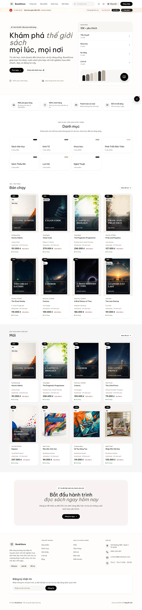
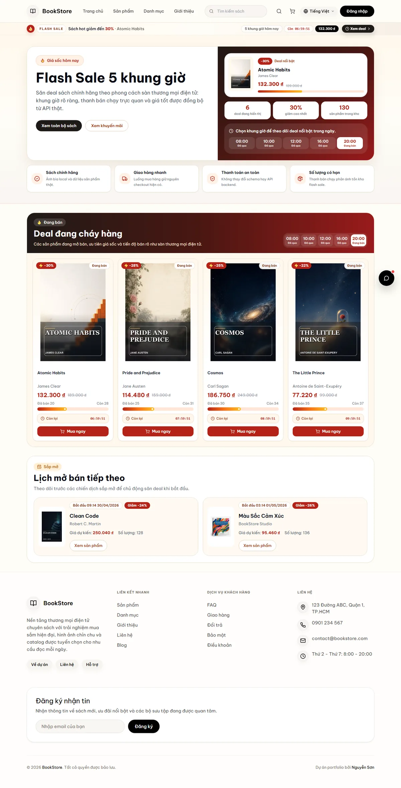
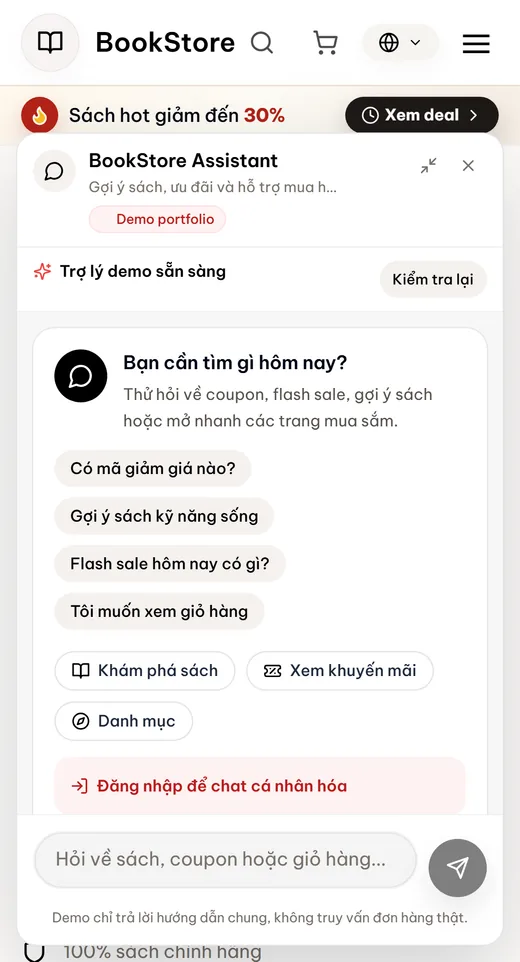

# BookStore Commerce Platform

BookStore là dự án portfolio thương mại điện tử bán sách được xây theo hướng production-style. Dự án kết hợp Spring Boot API, Next.js storefront, database PostgreSQL/MySQL, admin dashboard, flash sale, chatbot, monitoring và bộ kiểm thử tự động.

Mục tiêu của repo không chỉ là “chạy được”, mà là thể hiện tư duy làm sản phẩm: luồng mua hàng rõ ràng, UI/UX đủ chỉn chu, kiểm thử có bằng chứng, deploy Render có tài liệu, và vận hành có checklist.

## Ảnh Preview Portfolio

Các ảnh dưới đây là bản preview nhẹ được track trong repo. Bộ screenshot full-size được generate local và không commit để tránh làm repo nặng.





Cập nhật lại screenshot sau khi chỉnh UI:

```bash
cd frontend
BASE_URL=http://localhost:3001 npm run portfolio:screenshots
```

PowerShell:

```powershell
cd frontend
$env:BASE_URL = "http://localhost:3001"
npm run portfolio:screenshots
```

## Phạm vi sản phẩm

- Storefront public: danh mục, chi tiết sách, khuyến mãi, wishlist, giỏ hàng, checkout và lịch sử đơn hàng.
- Flash sale theo khung giờ với deal đang bán và chiến dịch sắp mở.
- API proxy cùng origin để local, Docker và Render hoạt động nhất quán.
- Chatbot hỗ trợ khách hàng, có health handling và fallback an toàn khi provider chưa bật.
- Admin dashboard cho sản phẩm, đơn hàng, người dùng và kiểm tra vận hành.
- SEO metadata, Open Graph image, sitemap, robots, JSON-LD và web vitals.
- Health monitoring cho frontend, backend và database.

## Công nghệ

| Phần | Công nghệ |
| --- | --- |
| Frontend | Next.js 16 App Router, React 19, TypeScript, Tailwind CSS, React Query, Zustand |
| Backend | Spring Boot 3.2, Java 17, Spring Security, JWT, Spring Data JPA, Actuator |
| Database | MySQL cho local/CI, PostgreSQL cho Render |
| Testing | Vitest, Playwright, Maven, npm audit |
| DevOps | Docker Compose, Render Blueprint, GitHub Actions, GHCR, Docker Hub tùy chọn |
| Mobile | Expo workspace, giữ nền tảng cho giai đoạn mobile release sau này |

## Bằng chứng chất lượng

Lần audit local production gần nhất: **29/04/2026**.

| Gate | Command | Kết quả hiện tại |
| --- | --- | --- |
| Frontend build | `cd frontend && npm run build` | Pass |
| Frontend lint | `cd frontend && npm run lint` | Pass |
| Unit test frontend | `cd frontend && npm run test:run` | 150 test pass |
| Audit UI/SEO public | `cd frontend && BASE_URL=http://localhost:3001 npm run test:e2e:portfolio-audit` | 49 test pass |
| Luồng mua hàng | `cd frontend && BASE_URL=http://localhost:3001 npm run test:e2e:journey` | 5 pass, 1 skip có chủ đích cho case mobile-only |
| Admin smoke audit | `cd frontend && BASE_URL=http://localhost:3001 npm run test:e2e:admin-portfolio` | 6 test pass |
| Dependency audit | `cd frontend && npm audit --audit-level=moderate` | 0 vulnerability |
| Health monitor | `cd frontend && npm run monitor:health` | Frontend, backend, database đều UP |
| Backend compile | `cd backend && mvn -q -DskipTests compile` | Pass |

## Chạy nhanh

### 1. Tạo file môi trường local

```powershell
copy .env.example .env
```

macOS/Linux:

```bash
cp .env.example .env
```

Chỉ chỉnh `.env` khi cần cấu hình riêng như database, Grok, mail, VNPay hoặc flash-sale schedule.

### 2. Chạy toàn bộ stack bằng Docker Compose

```bash
docker compose up -d --build
```

Các service local:

- Frontend: [http://localhost:3001](http://localhost:3001)
- Backend API: [http://localhost:8080/api](http://localhost:8080/api)
- Swagger UI: [http://localhost:8080/api/swagger-ui.html](http://localhost:8080/api/swagger-ui.html)
- Backend readiness: [http://localhost:8080/api/health/ready](http://localhost:8080/api/health/ready)

### 3. Chạy frontend theo dạng production local

```bash
cd frontend
npm run start:local
```

`start:local` build lại Next standalone, chuẩn bị static assets, dừng process cũ ở port `3001`, rồi chạy server giống cách Docker/Render vận hành.

## Development local

Backend:

```bash
cd backend
mvn spring-boot:run -Dspring-boot.run.profiles=local
```

Frontend:

```bash
cd frontend
npm install
npm run dev
```

Profile `local` và `dev` của backend đọc file `.env` ở root repo thông qua Spring config import, nên không cần export biến môi trường thủ công trong luồng dev bình thường.

## Deploy Render

Repo có sẵn `render.yaml` để tạo 3 resource:

- `bookstore-db`: PostgreSQL database
- `bookstore-api`: Spring Boot backend
- `bookstore-web`: Next.js frontend

Auto deploy đang được tắt có chủ đích (`autoDeployTrigger: off`) để tránh tiêu hao pipeline minutes ngoài ý muốn trên free tier. Khi có pipeline minutes, deploy thủ công trong Render dashboard hoặc dùng deploy hooks đã cấu hình.

Xem chi tiết tại [Hướng dẫn Deploy Render](./docs/render-deployment-guide-vn.md).

## Bảo mật

- Không commit secret thật. Dùng `.env` cho local và deployment secrets cho Render/GitHub.
- `JWT_SECRET`, database credentials, mail credentials, VNPay keys và Grok API key phải được giữ riêng tư.
- Public health/chatbot response đã được sanitize để không lộ lỗi provider hoặc thông tin nhạy cảm của user.
- Mật khẩu demo account trên Render được generate bằng env value, không hard-code và không ghi log.

Xem thêm [Security Audit Notes](./docs/security-audit.md).

## Tài liệu

- [Mục lục tài liệu](./docs/README_VN.md)
- [Kiến trúc hệ thống và CI/CD](./docs/architecture-and-cicd-vn.md)
- [Hướng dẫn Deploy Render](./docs/render-deployment-guide-vn.md)
- [Production Runbook](./docs/production-runbook-vn.md)
- [Portfolio Assets](./docs/portfolio/README.md)
- [README tiếng Anh](./README.md)

## Cấu trúc repo

```text
Ecommerce_BookStore/
|-- backend/          # Spring Boot REST API
|-- frontend/         # Next.js storefront và admin UI
|-- mobile/           # Expo mobile workspace
|-- docs/             # Kiến trúc, deploy, bảo mật, runbook, portfolio assets
|-- scripts/          # Health monitor và helper CI
|-- docker-compose.yml
|-- Dockerfile.backend
+-- Dockerfile.frontend
```

## Trạng thái hiện tại

Codebase đã được verify production local và sẵn sàng cho lần deploy Render tiếp theo. Bước ngoài hệ thống còn lại là redeploy trên Render khi có pipeline minutes, sau đó chạy lại checklist post-deploy trên URL live.
