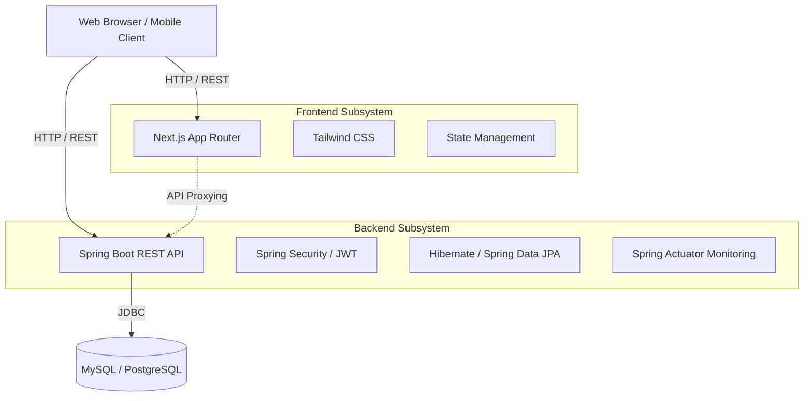
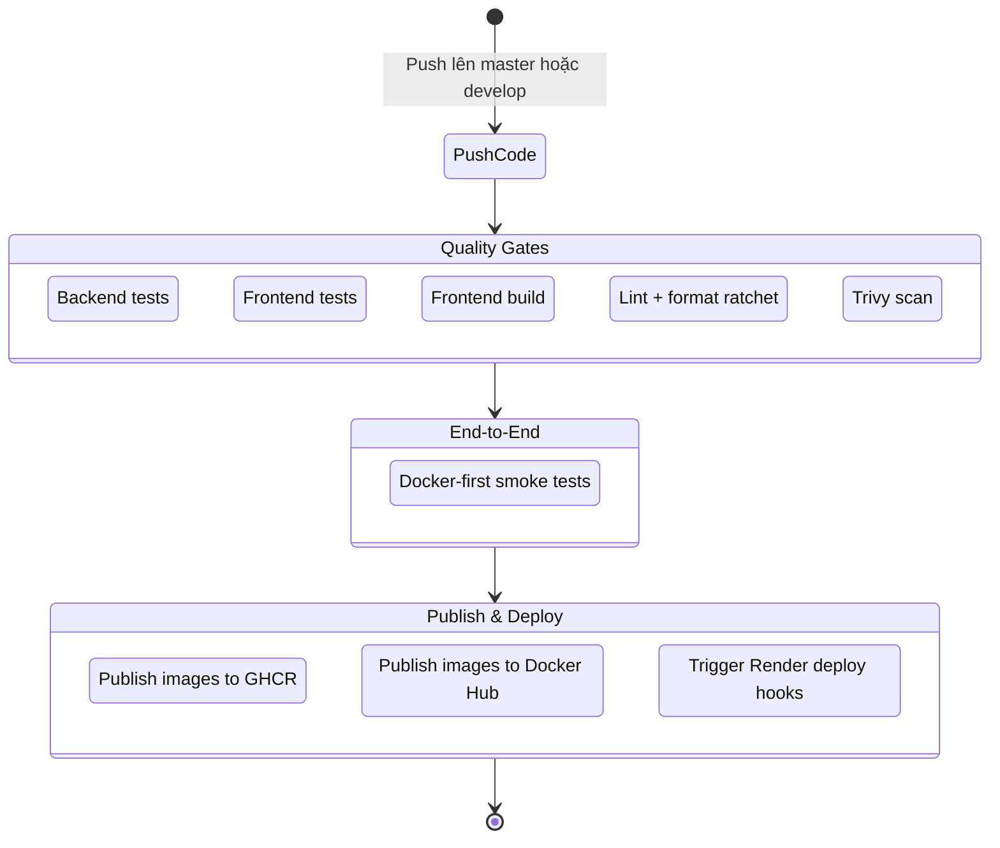

# Kiến trúc Hệ thống & CI/CD Pipeline

Tài liệu này mô tả tổng quan kỹ thuật của Ecommerce BookStore và cách pipeline CI/CD đang vận hành.

---

## Kiến trúc hệ thống

Ứng dụng đi theo mô hình **micro-monolith**:

- **Frontend**: Next.js 16 App Router
- **Backend**: Spring Boot 3.x REST API
- **Database**: MySQL cho local/E2E, PostgreSQL cho Render production
- **Proxy runtime**: frontend gọi backend qua `/api`

### Sơ đồ thành phần

### Diễn giải

1. **Frontend**
   - Render giao diện, SEO, điều hướng và trạng thái người dùng.
   - Proxy các request `/api` sang backend để tránh CORS drift giữa local, Docker và production.
2. **Backend**
   - Xử lý auth JWT, giỏ hàng, đơn hàng, flash sale, chatbot và các nghiệp vụ thương mại điện tử.
   - Dùng Spring Data JPA/Hibernate làm lớp ORM chính.
3. **Database**
   - Local và CI backend test ưu tiên MySQL 8.
   - Render production dùng PostgreSQL thông qua profile `render`.

---

## Pipeline CI/CD

Pipeline chính nằm ở [`.github/workflows/ci.yml`](../.github/workflows/ci.yml).

### Sơ đồ luồng CI/CD

### Các lane chính

1. **Backend Test**
   - Chạy Maven test trên MySQL 8 trong GitHub Actions.
   - Kiểm tra coverage backend tối thiểu 50%.
2. **Frontend Test / Build**
   - Chạy Vitest, coverage, lint và Next.js build.
3. **E2E**
   - Dùng Playwright smoke test trên stack Docker.
4. **Registry publish**
   - Publish image lên GHCR và Docker Hub.
   - Tag chuyên nghiệp theo semver:
     - `latest`
     - `v1.1.2`
     - `v1`
5. **Render deploy**
   - Gọi deploy hooks sau khi toàn bộ gate chính đã xanh.

### Ghi chú vận hành

- Render hiện dùng **Blueprint/source deploy**, nên lịch sử deploy trên dashboard vẫn hiển thị theo **commit hash**.
- Tag semver áp dụng cho artifact registry, không thay đổi cách Render hiển thị source revision.
- Với profile `render`, `RenderDataSourceConfig` tự động parse biến `DATABASE_URL` thành JDBC URL hợp lệ. Nếu `DATABASE_URL` không có, hệ thống dùng các biến `DB_HOST`, `DB_PORT`, `DB_NAME`, `DB_USERNAME`, `DB_PASSWORD` làm dự phòng.
