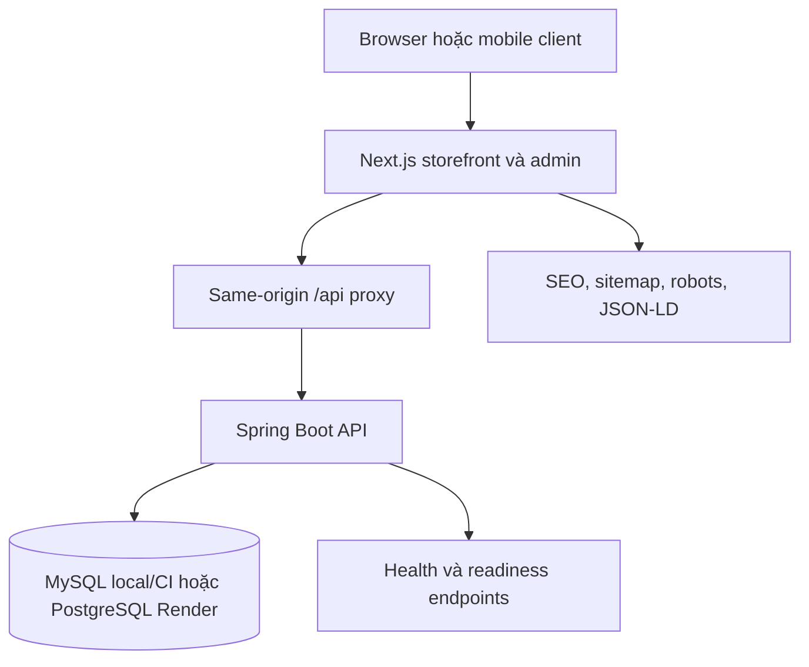
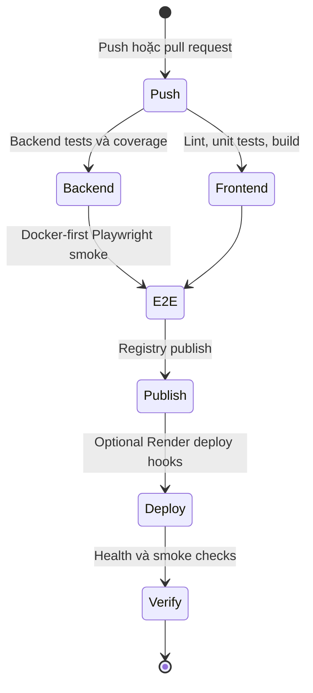

# Kiến trúc hệ thống và CI/CD

Tài liệu này mô tả kiến trúc hiện tại của BookStore, ranh giới runtime, quality gates và luồng deploy.

## Tổng quan hệ thống

BookStore đi theo kiến trúc full-stack module rõ ràng:

- **Frontend**: Next.js 16 App Router, phục vụ storefront public, admin UI, SEO metadata và same-origin API proxy.
- **Backend**: Spring Boot REST API, xử lý auth, catalog, cart, checkout, flash sale, chatbot, admin và health endpoints.
- **Database**: MySQL cho local/CI, PostgreSQL cho Render production.
- **Runtime proxy**: browser gọi `/api` trên frontend; frontend forward request sang backend.

## Request flow

1. Browser tải route Next.js từ frontend service.
2. Các request public data đi qua `/api` trên frontend.
3. Frontend proxy forward request tới backend được cấu hình bởi `API_PROXY_TARGET`.
4. Backend áp dụng validation, rate limiting, security headers và business logic.
5. Backend trả về response public đã sanitize hoặc dữ liệu authenticated theo session hiện tại.

Cách này giúp local, Docker và Render chạy nhất quán, đồng thời tránh lệch CORS giữa các môi trường.

## Runtime profiles

| Profile | Database | Mục đích |
| --- | --- | --- |
| `local` | Local MySQL hoặc DB local được cấu hình | Development hằng ngày |
| `dev` | Local/dev database | Manual exploratory development |
| `test` / CI | MySQL service trong CI | Backend và integration tests |
| `render` | Render PostgreSQL | Public deployment |

Trong profile `render`, `RenderDataSourceConfig` parse `DATABASE_URL` của Render thành JDBC URL với credentials tách riêng. Nếu thiếu `DATABASE_URL`, các biến `DB_*` được dùng làm fallback.

## Quality gates

Workflow chính nằm ở [`.github/workflows/ci.yml`](../.github/workflows/ci.yml).

Các lane chính:

- Backend test chạy bằng Maven, bao phủ service layer, controller, security và persistence behavior.
- Frontend chạy ESLint, Vitest và Next.js production build.
- Playwright kiểm tra UI public quan trọng cho portfolio, luồng mua hàng, chatbot, mobile menu/search/cart, checkout và admin smoke flow.
- `npm audit` và security audit hỗ trợ kiểm soát dependency/runtime hardening.

## Mô hình deploy Render

`render.yaml` tạo:

- `bookstore-db`
- `bookstore-api`
- `bookstore-web`

Hai web service dùng Docker runtime và hiện đặt `autoDeployTrigger: off`. Đây là chủ đích để kiểm soát deploy thủ công hoặc qua deploy hook rõ ràng, đặc biệt với workspace free-tier có giới hạn pipeline minutes.

Health path hiện tại trong `render.yaml`:

- Backend service health check: `/api/health/live`
- Frontend service health check: `/`
- Frontend aggregate health endpoint: `/api/health`
- Backend readiness endpoint cho monitoring: `/api/health/ready`

## Registry và release notes

GitHub Actions publish image lên GHCR tự động và có thể publish Docker Hub khi cấu hình:

- `DOCKERHUB_USERNAME`
- `DOCKERHUB_TOKEN`

Tag registry theo semver-style:

- `latest`
- `v1.1.2`
- `v1`

Lịch sử deploy của Render source deploy hiển thị commit hash, đây là hành vi bình thường của Blueprint/source deployment. Registry tags mô tả image artifact, không thay đổi revision label trên Render dashboard.

## Điều kiện xem là production-ready local

Codebase được xem là production-ready local khi các check sau pass:

- Frontend build, lint, unit test, E2E portfolio audit, storefront journey và admin smoke test.
- Backend compile hoặc test lane.
- Dependency audit không có vulnerability mức moderate trở lên.
- Health monitor báo frontend, backend và database đều `UP`.

Xem [Production Runbook](./production-runbook-vn.md) để lấy command đầy đủ.
