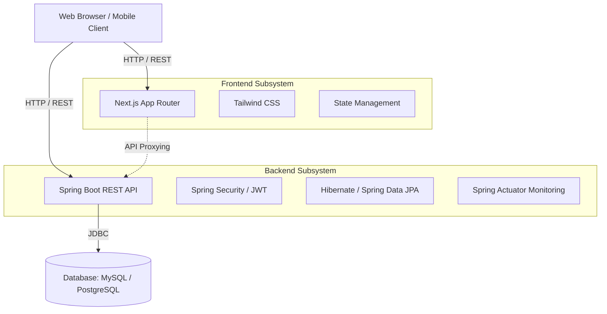
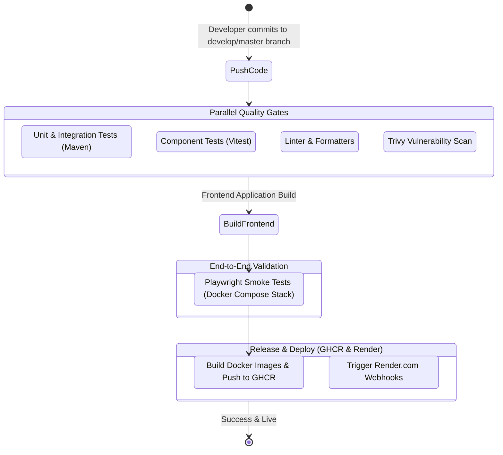

# Kiến trúc Hệ thống & CI/CD Pipeline

Tài liệu này cung cấp cái nhìn tổng quan về kỹ thuật của hệ thống Ecommerce BookStore cùng với các quy trình làm việc tự động hóa.

---

## Kiến trúc Hệ thống

Ứng dụng tuân theo mô hình **Micro-monolith**. Nó tách biệt hoàn toàn phần giao diện người dùng (frontend client) với phần lõi xử lý nghiệp vụ (backend core) thông qua RESTful APIs, nhưng vẫn duy trì backend dưới dạng một khối liền mạch (monolith) để dễ dàng triển khai và ở quy mô hiện tại.

### Các thành phần tổng quan (High-Level Components)

### Chi tiết Thành phần
1. **Frontend (Next.js 14 App Router)**
   - Chịu trách nhiệm hiển thị giao diện, tối ưu hoá SEO (thông qua SSR/SSG), và tương tác với người dùng.
   - Sử dụng `next.config.js` để proxy các lệnh gọi `/api/...` trực tiếp qua Backend nhằm xử lý hoàn hảo vấn đề lỗi CORS, từ đó coi Backend giống như phần mở rộng trên cùng một domain.

2. **Backend (Spring Boot 3.x)**
   - Đảm nhận toàn bộ nghiệp vụ lõi như Authentication (Sử dụng JWT phi trạng thái), Quản lý Giỏ hàng, Xử lý Đơn hàng, và các tính năng Tự động hóa Marketing như Flash Sales, Nhắc nhở giỏ hàng.
   - Cơ chế giới hạn tỷ lệ yêu cầu (Rate Limiting) được áp dụng nghiêm ngặt qua thư viện Bucket4j để phòng chống các đợt tấn công brute-force hoặc DDoS.

3. **Tầng Cơ sở Dữ liệu (Database Layer)**
   - **Local / Development Workflow:** Mặc định sử dụng **MySQL 8**. Setup dễ dàng không cần cài cắm phức tạp nhờ vào `docker-compose.yml`.
   - **Production (Render.com) Workflow:** Database có khả năng chuyển linh hoạt sang **PostgreSQL** cực kỳ mượt mà nhờ vào sự tương thích của tầng phiên dịch Hibernate/JPA.

---

## Pipeline CI/CD

Tính tin cậy của dự án được đảm bảo bởi quy trình Tích hợp và Triển khai liên tục (CI/CD) rất khắt khe thông qua **GitHub Actions** (`.github/workflows/ci.yml`).

### Sơ đồ Quy trình Công việc CI/CD 

### Các Giai đoạn trong Pipeline

1. **Kiểm thử và Chất lượng code (`backend-test`, `frontend-test`, `code-quality`)**
   - Mã nguồn Java được xác minh bằng hàng loạt kiểm thử đơn vị (Unit Tests) và kiểm thử tích hợp mô phỏng (Mocked Integration tests).
   - Phần Frontend được bảo vệ bởi các test component của Vitest.
   - ESLint và Prettier kiểm tra mã codebase đảm bảo format đồng nhất.
2. **Kiểm tra Bảo mật (`security`)**
   - Dùng **Trivy** để scan toàn bộ repository phát hiện sớm tất cả các lổ hổng bảo mật rò rỉ.
3. **E2E Testing (`e2e-test`)**
   - Bật toàn bộ stack (MySQL, Backend, Frontend) thông qua riêng một profile Compose đặc biệt (`docker-compose.e2e.yml`).
   - Khởi động **Playwright** bằng mô phỏng thao tác giả lập UI giống như luồng mua vé và thanh toán của khách hàng thực để xác nhận (smoke tests).
4. **Đẩy ảnh Docker (`docker-publish-backend`, `docker-publish-frontend`)**
   - Chỉ được kích hoạt khi code đẩy qua nhánh `develop` hoặc `master`.
   - Docker hóa toàn bộ frontend / backend và push thẳng ảnh image lên kho GitHub (GHCR).
5. **Deploy (`deploy-staging`, `deploy-production`)**
   - Tự động gọi API (webhook) thông qua lệnh `curl` lên Render bằng các cấu hình được ẩn trong Action Secrets.
   - Nhận được tín hiệu, Render tiến hành tải code bản mới nhất và build môi trường Live.
