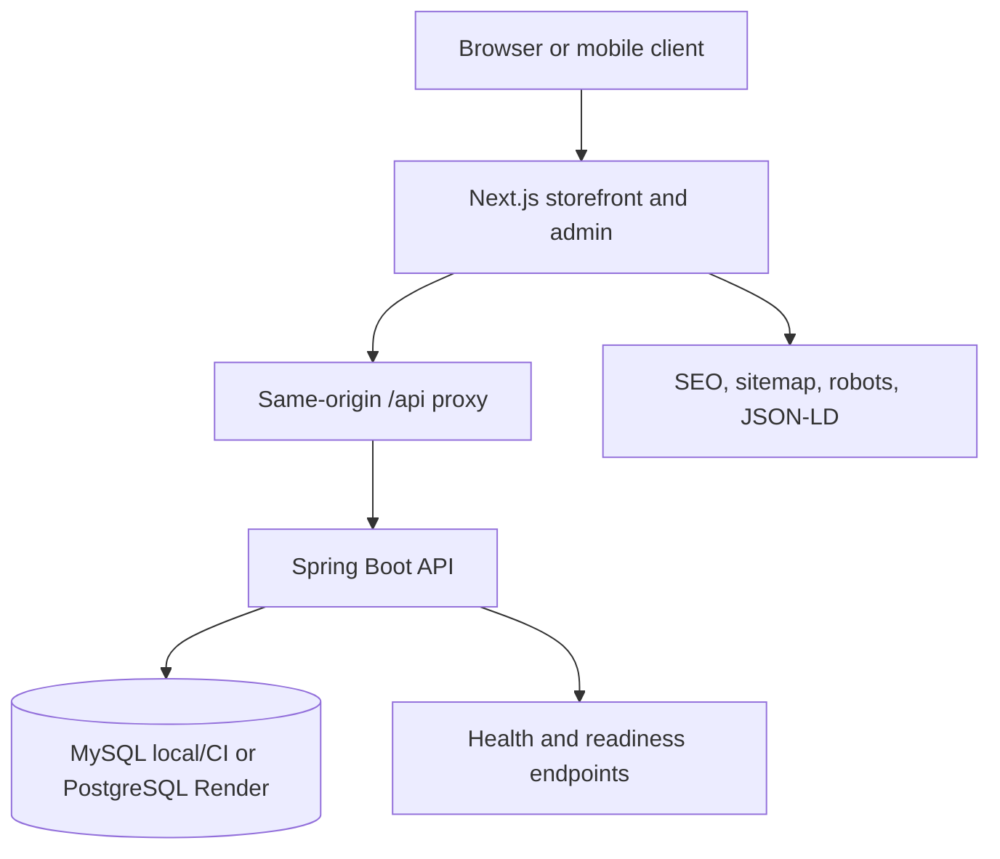
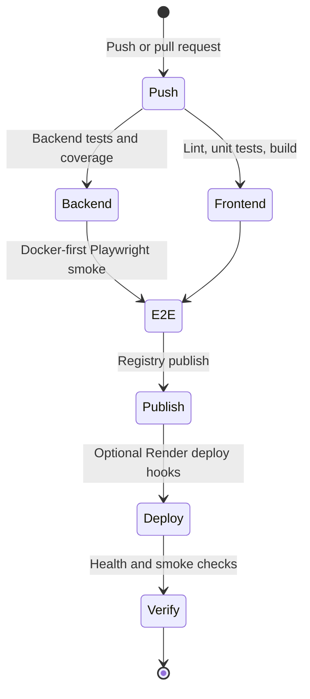

# System Architecture and CI/CD

This document summarizes the current BookStore architecture, runtime boundaries, quality gates, and deployment flow.

## System Overview

BookStore follows a modular full-stack architecture:

- **Frontend**: Next.js 16 App Router serving the public storefront, admin UI, SEO metadata, and same-origin API proxy.
- **Backend**: Spring Boot REST API owning authentication, catalog, cart, checkout, flash sale, chatbot, admin, and health endpoints.
- **Database**: MySQL for local and CI lanes, PostgreSQL for Render production.
- **Runtime proxy**: the browser calls the frontend `/api` surface; the frontend forwards requests to the backend.

## Request Flow

1. The browser loads a Next.js route from the frontend service.
2. Public data requests go through `/api` on the frontend.
3. The frontend proxy forwards the request to the backend configured by `API_PROXY_TARGET`.
4. The backend applies validation, rate limiting, security headers, and business logic.
5. The backend returns sanitized public responses or authenticated data based on the active session.

This keeps local, Docker, and Render behavior aligned and avoids frontend CORS drift.

## Runtime Profiles

| Profile | Database | Intended use |
| --- | --- | --- |
| `local` | Local MySQL or configured local DB | Developer workflow |
| `dev` | Local/dev database | Manual exploratory development |
| `test` / CI | MySQL service in CI | Backend and integration tests |
| `render` | Render PostgreSQL | Public deployment |

In the `render` profile, `RenderDataSourceConfig` parses Render's `DATABASE_URL` into a JDBC URL with separate credentials. If `DATABASE_URL` is unavailable, the `DB_*` variables act as fallback.

## Quality Gates

The main workflow is [`.github/workflows/ci.yml`](../.github/workflows/ci.yml).

Key lanes:

- Backend tests run through Maven and exercise the service layer, controllers, security, and persistence behavior.
- Frontend lanes run ESLint, Vitest, and Next.js production build.
- Playwright covers portfolio-critical public UI, storefront journey, chatbot behavior, mobile menu/search/cart, checkout, and admin smoke flows.
- `npm audit` and the documented security audit support dependency and runtime hardening.

## Render Deployment Model

`render.yaml` provisions:

- `bookstore-db`
- `bookstore-api`
- `bookstore-web`

Both web services use Docker runtime and currently set `autoDeployTrigger: off`. This is intentional so deploys can be controlled manually or through explicit deploy hooks, especially on free-tier workspaces where pipeline minutes are limited.

Current Render health paths from `render.yaml`:

- Backend service health check: `/api/health/live`
- Frontend service health check: `/`
- Frontend aggregate health endpoint: `/api/health`
- Backend readiness endpoint for monitoring: `/api/health/ready`

## Registry and Release Notes

GitHub Actions publishes images to GHCR automatically and can publish to Docker Hub when these secrets are configured:

- `DOCKERHUB_USERNAME`
- `DOCKERHUB_TOKEN`

Registry tags use semver-style names such as:

- `latest`
- `v1.1.2`
- `v1`

Render source deploy history displays commit hashes, which is expected for Blueprint/source deployments. Registry tags describe image artifacts, not Render dashboard revision labels.

## Operational Guarantees

The codebase is considered locally production-ready when these checks pass:

- Frontend build, lint, unit tests, E2E portfolio audit, storefront journey, and admin smoke tests.
- Backend compile or test lane.
- Dependency audit with no moderate or higher vulnerabilities.
- Health monitor reports frontend, backend, and database as `UP`.

See [Production Runbook](./production-runbook.md) for the exact command sequence.
