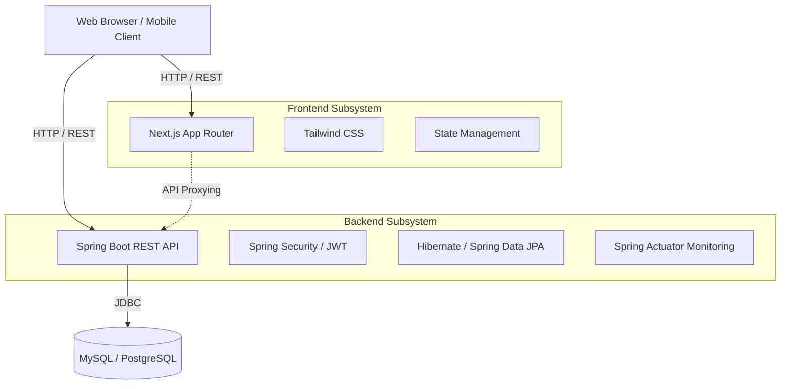
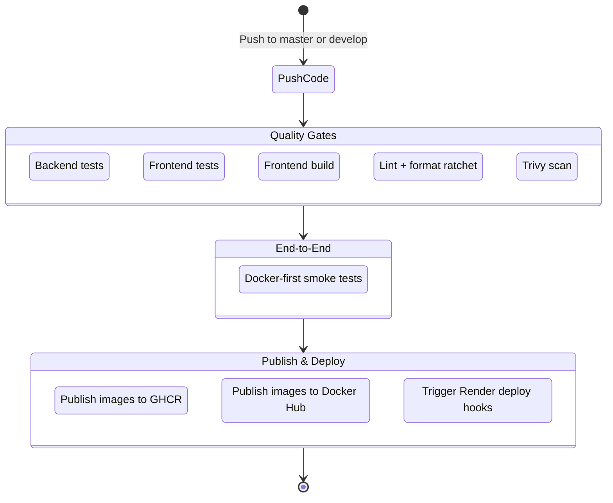

# System Architecture & CI/CD Pipeline

This document summarizes the current technical architecture of Ecommerce BookStore and the delivery pipeline that protects the production line.

---

## System architecture

The application follows a **micro-monolith** model:

- **Frontend**: Next.js 16 App Router
- **Backend**: Spring Boot 3.x REST API
- **Database**: MySQL for local/E2E, PostgreSQL for Render production
- **Runtime proxy**: frontend reaches backend through `/api`

### High-level view

### Notes

1. **Frontend**
   - Handles presentation, navigation, SEO, and client-side state.
   - Proxies `/api` requests to the backend so local, Docker, and production stay aligned.
2. **Backend**
   - Owns authentication, cart, checkout, flash sale, chatbot, and core business logic.
   - Uses Spring Data JPA/Hibernate as the main ORM layer.
3. **Database**
   - MySQL is the default choice for local development and CI backend test lanes.
   - PostgreSQL is used for the Render production profile.

---

## CI/CD pipeline

The primary workflow lives in [`.github/workflows/ci.yml`](../.github/workflows/ci.yml).

### Workflow shape

### Key lanes

1. **Backend Test**
   - Runs Maven tests against MySQL 8 in GitHub Actions.
   - Enforces a minimum backend line coverage threshold.
2. **Frontend Test / Build**
   - Runs Vitest, coverage, lint, and the Next.js production build.
3. **E2E**
   - Uses Playwright against the Docker stack for portfolio-critical smoke coverage.
4. **Registry publish**
   - Publishes images to GHCR and Docker Hub.
   - Public tags follow semver-first naming:
     - `latest`
     - `v1.0.0`
     - `v1`
5. **Render deploy**
   - Triggers Render deploy hooks after the required gates pass.

### Operational notes

- Render currently uses **Blueprint/source deploy**, so Render's deploy history naturally displays **commit hashes** rather than release tags.
- Semver tags apply to registry artifacts, not to the Render event history UI.
- In the `render` Spring profile, `RenderDataSourceConfig` auto-parses the `DATABASE_URL` env var into a valid JDBC URL. If `DATABASE_URL` is absent, the individual `DB_HOST`, `DB_PORT`, `DB_NAME`, `DB_USERNAME`, and `DB_PASSWORD` properties are used as fallback.
