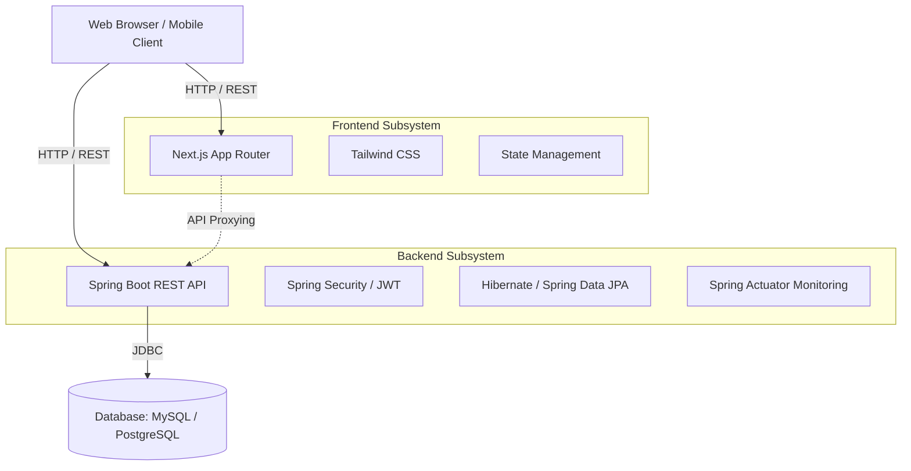
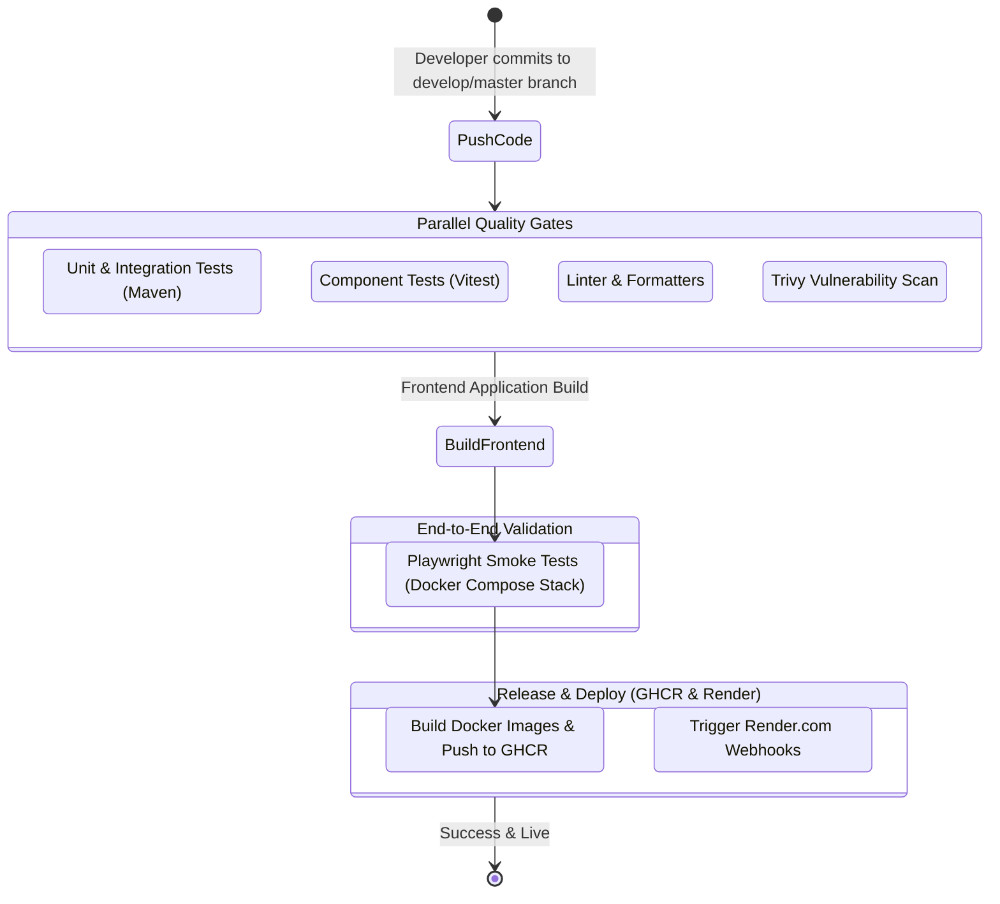

# System Architecture & CI/CD Pipeline

This document provides a technical overview of the Ecommerce BookStore's architecture and automated workflows.

---

## System Architecture

The application follows a **Micro-monolith** architecture pattern, explicitly separating the frontend client presentation from the backend core logic via RESTful APIs, while keeping the backend manageable as a single scalable unit.

### High-Level Components

### Component Details

1. **Frontend (Next.js 14 App Router)**
   - Responsible for rendering UI components, SEO optimization (via SSR/SSG algorithms), and user interactions.
   - Utilizes `next.config.js` to proxy certain `/api/...` calls directly to the Backend, bypassing CORS issues and treating the Backend as a cohesive extension of the site.
   
2. **Backend (Spring Boot 3.x)**
   - Handles strict business logic including Authentication (Stateless JWT), Cart Management, Order Processing, and robust Marketing Automation features (Flash Sales, Cart reminders).
   - Rate limiting is strictly enforced using Bucket4j to prevent brute-force and DDoS attacks.
   
3. **Database Layer**
   - **Local / Development Workflow:** Defaults to **MySQL 8**. Setup effortlessly via the local `docker-compose.yml`.
   - **Production (Render.com) Workflow:** Swaps dynamically to **PostgreSQL**. Made completely seamless by Hibernate's JPA translation layer.

---

## CI/CD Pipeline

The project ensures high reliability through a rigorous Continuous Integration and Continuous Deployment pipeline configured via **GitHub Actions** (`.github/workflows/ci.yml`).

### CI/CD Workflow Diagram

### Pipeline Stages

1. **Code Quality and Testing (`backend-test`, `frontend-test`, `code-quality`)**
   - Java code is verified with unit and mocked integration tests.
   - Frontend is verified with Vitest.
   - ESLint and Prettier check the codebase for style consistency.
2. **Security (`security`)**
   - Utilizing **Trivy** to scan the repository for exposed vulnerabilities or compromised dependencies.
3. **E2E Testing (`e2e-test`)**
   - Starts the entire stack (MySQL, Backend, Frontend) via a specialized profile (`docker-compose.e2e.yml`).
   - Runs UI-driven **Playwright** smoke tests simulating real customer checkout paths.
4. **Publish (`docker-publish-backend`, `docker-publish-frontend`)**
   - Only executed if the branch is `develop` or `master`.
   - Dockerizes the frontend and backend architectures and pushes images directly to the GitHub Container Registry (GHCR).
5. **Deploy (`deploy-staging`, `deploy-production`)**
   - Automatically issues `curl` requests to Render's Deploy Hook endpoints securely stored in GitHub Actions secrets.
   - Render seamlessly triggers an environment rebuild.
